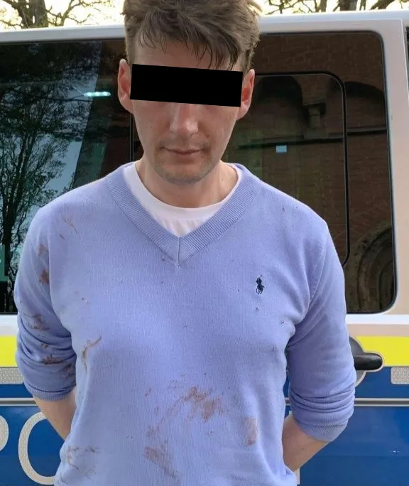
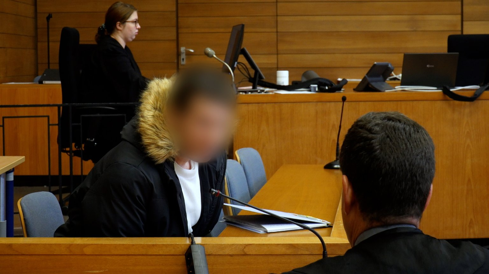
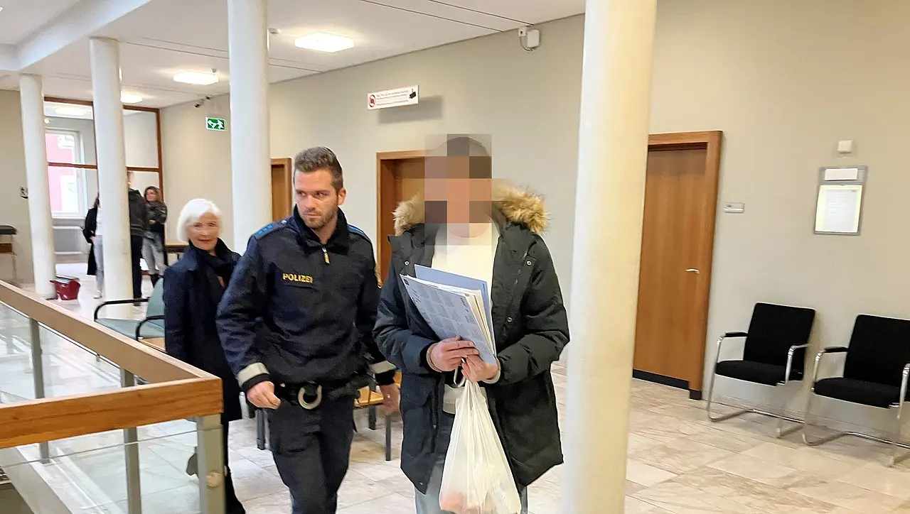
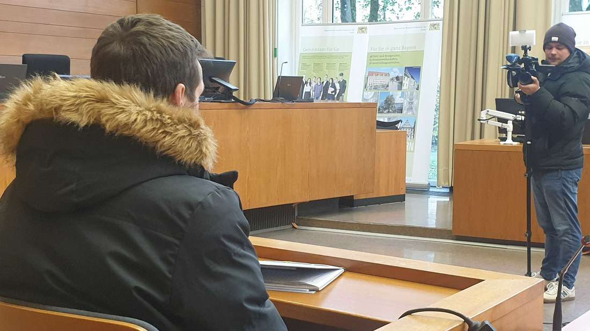
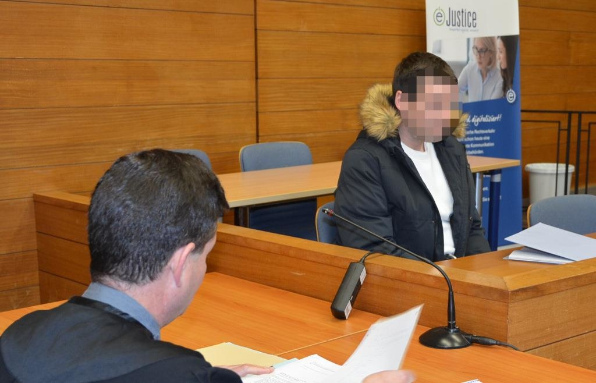
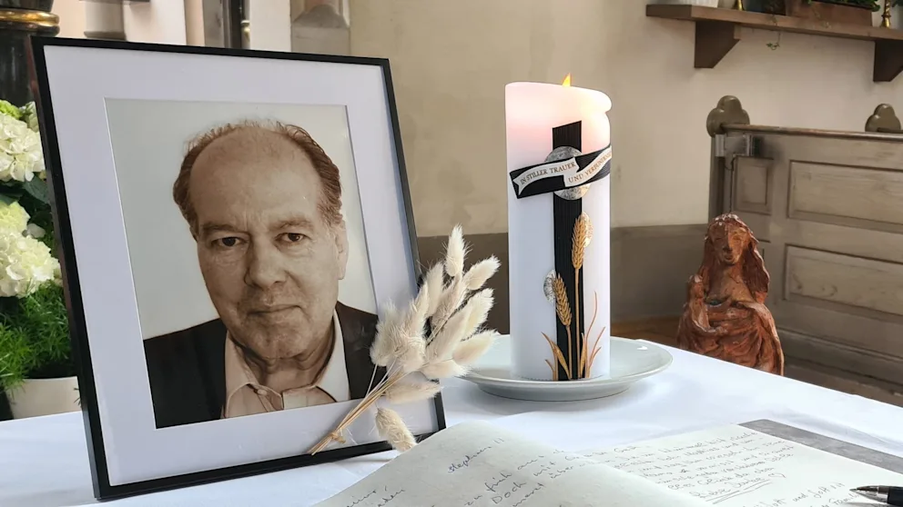
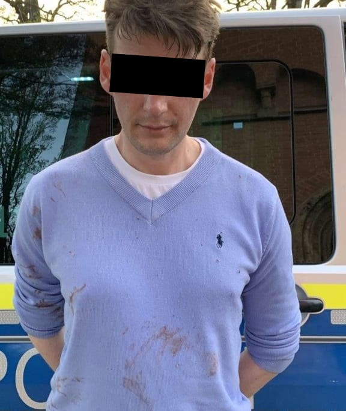
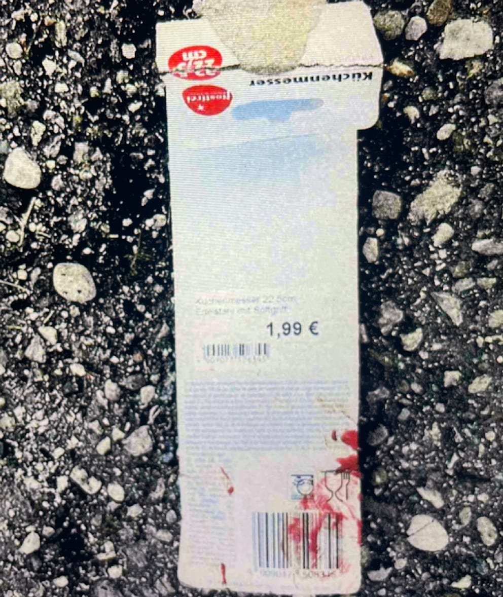
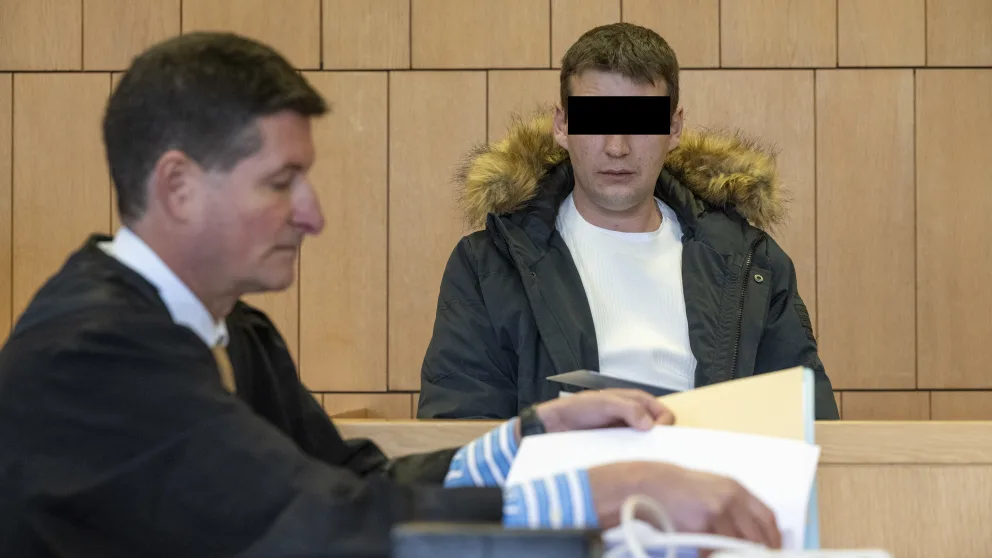
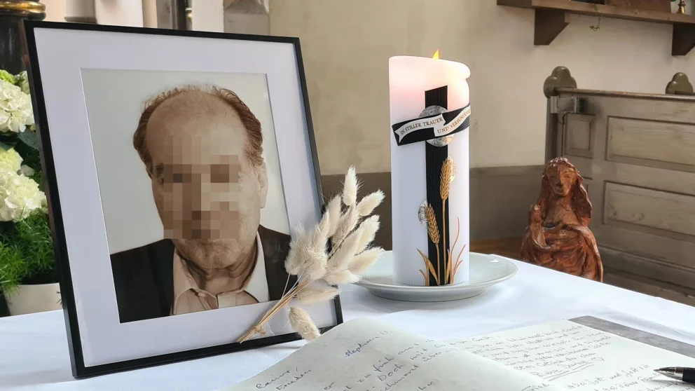

# Dominik Sobota

Am 8. April 2024 ersticht Dominik Sobota den Dr. Rainer Gerth in Wasserburg am Inn

<!--

-->

Seitdem ist Dominik eingesperrt in einer Psychiatrie, vermutlich in
[Mainkofen](https://www.mainkofen.de/kontakt/impressum/)

```
Dominik Sobota
Gefangener
Bezirksklinikum Mainkofen
Mainkofen A 3
94469 Deggendorf

Tel. +49 9931 87-0
Fax +49 9931 87-30099
E-Mail: kontakt@mainkofen.de
```

Alle Mainstream-Medien bezeichnen ihn immer nur als "Dominik S. (41)" und zeigen nur verpixelte Fotos,
während das Opfer (Dr. Rainer Gerth) vom Mainstream gefeiert wird als Held.
Scheiss auf den Scheiss, die Realität ist genau andersrum, Dr. Rainer Gerth ist der Täter und Dominik Sobota ist das Opfer.
Dominik Sobota ist unschuldig, weil Tyrannenmord ist legal.

Wer selber noch nie Gefangener in einer Psychiatrie war,
der darf hier nicht mitreden, der soll hier schön seine Fresse halten.


<!--

## Fotos










-->


## Zeitungsartikel


### Bild 04.11.2024

https://www.bild.de/regional/bayern/traunstein-messer-killer-spaehte-arzt-tagelang-aus-raechte-sich-fuer-gutachten-6728aa4ecb8c781698a0009c

<blockquote>

BILD / Regional / Bayern / Traunstein: Messer-Killer spähte Arzt tagelang aus, rächte sich für Gutachten

Dominik S. rächte sich für ein Gutachten

Messer-Killer spähte Arzt tagelang aus

<blockquote>


Der Angeklagte Dominik S. (41) soll im Rache-Wahn den Gutachter erstochen haben, der zu seiner Einweisung in eine Klinik beigetragen hatte

Foto: Joerg Voelkerling

</blockquote>

Jörg Völkerling

04.11.2024 - 18:39 Uhr

Traunstein (Bayern) – Er spähte sein Opfer tagelang aus, streunte durch den Park des Inn-Salzach-Klinikums in Wasserburg,
passte Oberarzt Dr. Rainer Gerth (†64) dann auf dem Weg in den Feierabend ab:
Dominik S. (41) erstach im Rache-Wahn den Gutachter, der 2010 zu seiner Einweisung in diese Klinik beigetragen hatte.

Seit Montag (4. November) muss sich der Drogenabhängige wegen Mordes vor dem Landgericht Traunstein in Bayern ver­antworten.

Messer-Killer mit wirren Aussagen vor Gericht

<blockquote>



Das Opfer: Oberarzt Dr. Rainer Gerth.
Seine Kinder nahmen am Prozess teil – wurden unter anderem von Star-Anwalt Harald Baumgärtl vertreten

Foto: privat

</blockquote>

„Hier werden die Insassen vergiftet, davor muss ich die Menschheit bewahren“, sagte Dominik S. bei seiner Fest­nahme am 8. April 2024.
Er hatte um 18.06 Uhr selbst die Notrufnummer alarmiert und sich ohne Widerstand festnehmen lassen.

Zum Prozessauftakt schockierte er die im Saal anwesenden Kinder des Opfers mit einer wirren Anklage gegen den Staat:
„Ich kam 1988 aus Schlesien in die BRD, in ein Land, in dem unsere Kinder verraten werden.
Sie mischen giftige Substanzen in die Nahrung, damit wir krank werden, horchen uns aus, misshandeln Straftäter in der Unterbringung.“
Wen er mit „sie“ mein­te, sagte er nicht.

<blockquote>


Nur Minuten nach der Tat: Dominik S. (41) ließ sich mit blutverschmiertem Pulli festnehmen

Foto: .

</blockquote>

Opfer schleppte sich nach der Tat noch 61 Meter weit

Staatsanwalt Wolfgang Fiedler hält den Arbeitslosen aufgrund einer paranoiden Schizophrenie für gemeingefährlich
und strebt seine dauerhafte Unterbringung im Maßregelvollzug an, wo sich S. schon von 2010 bis 2013 befand.
Dafür machte S. den Oberarzt der Forensik, Dr. Rainer Gerth, verantwortlich, der damals im Prozess aussagte.

<blockquote>


Staatsanwalt Wolfgang Fiedler hält den Messer-Mörder für sehr gefährlich

Foto: Joerg Voelkerling

</blockquote>

Staatsanwalt Fiedler schilderte sein bruta­les Vorgehen:
„Direkt neben dem Pkw griff der Beschuldigte den nichts ahnenden und deshalb schutzlosen Geschädigten
unvermittelt mit einem Küchenmesser bewaffnet von hinten an
und versetzte ihm in Tötungsabsicht mehrere Stiche mit dem Messer mit 12 cm Klingenlänge gegen den Oberkörperbereich.“

Dr. Gerth schleppte sich noch 61 Meter weit zurück zum Haupteingang, brach dann aber zusammen und verblutete.

„Er ist seiner Mission gefolgt“, sagte ein ebenfalls suchtkran­ker Freund (44) des Beschuldigten als erster Zeuge aus.
„Wir teilen eine gewisse Angst der Staatsmacht gegenüber“, sagte Gunnar B.
Er kannte Dominik S. aus der Kleinstadt Mölln in Schleswig-Holstein,
von wo S. im März dieses Jahres 840 Kilometer nach Wasserburg fuhr, um den Arzt anzugreifen.
In Wasserburg quartierte sich S. nach BILD-Informationen bei seinem Bruder ein
und spähte die Gewohnheiten seines Opfers aus.

Der Prozess drohte am Morgen kurzzeitig zu platzen,
weil ein Schöffe selbst im Inn-Salzach-Klinikum arbeitete und das Opfer kannte.
Er wurde wegen Befangenheit durch einen Ersatz-Mann ausgetauscht.
Ein Urteil will Richter Volker Ziegler am 19. November verkünden.

</blockquote>


### Bild 20.11.2024

https://www.bild.de/regional/bayern/mord-urteil-patient-ersticht-psychiater-mit-1-99-euro-messer-673b472cf6e6dc41129253f2

http://web.archive.org/web/20241120085010/https://www.bild.de/regional/bayern/mord-urteil-patient-ersticht-psychiater-mit-1-99-euro-messer-673b472cf6e6dc41129253f2

<blockquote>

BILD / Regional / Bayern / Mord-Urteil: Patient ersticht Psychiater mit 1,99-Euro-Messer

Mord-Urteil nach tödlicher Klinik-Attacke

Patient ersticht Psychiater mit 1,99-Euro-Messer

<blockquote>



Dominik S. stellte sich nach der Tat vor Ort. Er hatte selbst den Notruf verständigt

Foto: .

</blockquote>

Andreas Bachner

Jörg Völkerling

20.11.2024 - 09:45 Uhr

Traunstein – Das Etikett war noch blutverschmiert von den tödlichen Stichen!

Den Mord an Psychiater Dr. Rainer Gerth (†64) auf dem Klinik-Parkplatz in Wasserburg (Bayern) hatte Dominik S. (41)
mit einem Billig-Messer für 1,99 Euro vom Discounter begangen.
Jetzt wurde S. vom Landgericht Traunstein wegen heimtückischen Mordes verurteilt.
Er wird dauerhaft in einer geschlossenen psychiatrischen Einrichtung untergebracht.

<blockquote>



Das Preisschild des Tatmessers wurde am Tatort gefunden. Es war blutverschmiert

Foto: privat

</blockquote>

Im April 2024 hatte der Drogensüchtige dem Arzt auf dem Parkplatz des Inn-Salzach-Klinikums aufgelauert.
Er wollte sich an dem Psychiater der forensischen Abteilung rächen,
da dieser 2010 zur Einweisung von S. in die Klinik beigetragen haben soll.
Der Mediziner wollte nach Feierabend in seinen Wagen steigen, als S. ihn von hinten angriff und mehrmals zustach.

<blockquote>



Dominik S. (41) beim Prozess vor dem Traunsteiner Landgericht mit seinem Verteidiger Florian Wurtinger

Dominik S. (41) beim Prozess mit Verteidiger Florian Wurtinger. Er entschuldigte sich für die Tat, sagte aber: „Ich musste es tun.“

Foto: Joerg Voelkerling

</blockquote>

Die Tatwaffe hatte der Arbeitslose zuvor im März in einem Möbelgeschäft gekauft, beim „Kleinpreiskönig“ in Traunreut.
Das Etikett ließ er bis zur Tat am Messer, riss es ab und warf es weg.
Beamte der Spurensicherung fanden später das Preisschild auf dem Klinik-Parkplatz.

Nach der Tat wählte er selbst den Notruf

Nach der Bluttat hatte S. selbst den Notruf gewählt.
Er sagte demnach: „Hallo, kommen Sie zur Salzach-Klinik. Hier stellt sich gleich jemand.“ Dann legte er auf.
Von der Polizei ließ sich der Täter mit blutverschmierter Kleidung ohne Gegenwehr festnehmen.

<blockquote>



Opfer Dr. Rainer Gerth war als Psychiater in der Klinik tätig.
Seine Angehörigen nehmen am Prozess teil –
werden von den Anwälten Harald Baumgärtl, Markus Frank und Jörg Zürner vertreten

Opfer Dr. Rainer Gerth war als Psychiater in der Wasserburger Klinik tätig.
In einem Prozess 2010 gegen seinen späteren Mörder sollte Gerth als Gutachter einen Kollegen vertreten

Foto: privat

</blockquote>

Seit vergangener Woche wurde dem Drogensüchtigen der Prozess gemacht.
Schon als 15-Jähriger nahm Dominik S. Drogen und kam nie davon los.
Marihuana, Kokain, Heroin, schwere Beruhigungsmittel.
Insgesamt 13 Entziehungskuren hat er hinter sich, erfolglos.
Vor der Tat schien er immer weiter abzugleiten.

<blockquote>


Der Tatort: Der Psychiater wurde vor seinem Auto angegriffen. Auf dem Boden liegen blutverschmierte Akten

Der Griff des Billig-Messers wurde am Tatort gefunden. Die Klinge war bei dem brutalen Angriff abgebrochen

</blockquote>

Laut der psychiatrischen Sachverständigen fühlte er sich verfolgt, hatte Angst, man wolle ihn vergiften.
Sie stufte S. als schuldunfähig ein – er könne zwischen Recht und Unrecht nicht unterscheiden.
Diagnose: paranoide Schizophrenie.
Bei starken Isolationstendenzen bestünde eine „hohe Wahrscheinlichkeit für Gewaltdelikte“.

<blockquote>


Zum Prozessauftakt wurde der Angeklagte in Fußfesseln ins Gericht gebracht

Foto: Joerg Voelkerling

</blockquote>

Stich ins Herz tötete den Psychiater auf dem Parkplatz

Eine medizinische Gutachterin schilderte zudem die Brutalität der Tat.
S. stach derart wahnhaft auf den Psychiater ein, dass die 12-Zentimeter-Klinge des Billig-Messers abbrach.
Erst rammte S. mit „massiver Gewalteinwirkung“ dem Arzt das Messer in die Brust, spaltete eine Rippe und traf das Herz.
Dann stach er durch den linken Unterarm seines Opfers, dabei brach wohl die Klinge ab.
Die Tochter des Getöteten sagte zu Dominik S. vor der Urteilsverkündung:
„Du hast uns unseren Vater gewaltsam entrissen!“

<blockquote>


Die Angehörigen des getöteten Arztes nahmen am Prozess teil,
werden in der Nebenklage von den Anwälten Markus Frank (M., l.),
Harald Baumgärtl (M., r.) und Jörg Zürner (nicht im Bild) vertreten

Foto: Joerg Voelkerling

</blockquote>

Staatsanwalt Wolfgang Fiedler hält den Messer-Mörder für sehr gefährlich,
hatte daher die dauerhafte Unterbringung in einer geschlossenen Psychiatrie gefordert.

Die Kinder von Dr. Gerth, die den Prozess als Nebenkläger verfolgten,
reagierten erleichtert auf die Einweisung des Mörders ihres Vaters.
Der Anwalt von Tochter Verena, Harald Baumgärtl, sagte BILD:
„Aufgrund des fundierten Gutachtens der Sachverständigen
kann die Familie die langjährige Unterbringung nachvollziehen.“

</blockquote>

> Die Tatwaffe hatte der Arbeitslose zuvor im März in einem Möbelgeschäft gekauft, beim „Kleinpreiskönig“ in Traunreut.

Dominik lebte viele Jahre lang in Traunreut.
Meine Freundin aus Trostberg kennt ihn von früher.


## Stichworte

- ISK Wasserburg
  - Inn-Salzach-Klinikum Wasserburg
  - Inn-Salzach-Klinik Wasserburg
  - Zentralklinikum Wasserburg, kbo-Inn-Salzach-Klinikum gemeinnützige GmbH, Gabersee 7, D-83512 Wasserburg am Inn
- Selbstjustiz
  - [Was willst du tun, wenn der Staat dich fickt?](https://soundcloud.com/mila-nautikus/frauenarzt-was-willst-du-tun)
  - Nur Selbstjustiz bringt wahre Gerechtigkeit
  - Bürgerwehr
  - Tyrannenmord ist legal
- Schulmediziner sind Kriminelle
  - Scheiss auf Schulmediziner
  - Tod allen Schulmedizinern
- Psychiater sind Kriminelle
  - Psychiater sind Folterknechte
  - Scheiss auf Psychiater
  - Tod allen Psychiatern
- Psychiatrische Gutachter sind Kriminelle
  - Scheiss auf Psychiatrischen Gutachter
  - Tod allen Psychiatrischen Gutachtern
- Psychiatrie ist Folter
  - Psychiatrie ist ein Folterknast


## Mirrors

- [github.com/milahu/dominik-sobota](https://github.com/milahu/dominik-sobota)
- [righttoprivacy.onion/milahu/dominik-sobota](http://gg6zxtreajiijztyy5g6bt5o6l3qu32nrg7eulyemlhxwwl6enk6ghad.onion/milahu/dominik-sobota)
- [darktea.onion/milahu/dominik-sobota](http://it7otdanqu7ktntxzm427cba6i53w6wlanlh23v5i3siqmos47pzhvyd.onion/milahu/dominik-sobota)
- [darkforest.onion/milahu/dominik-sobota](http://git.dkforestseeaaq2dqz2uflmlsybvnq2irzn4ygyvu53oazyorednviid.onion/milahu/dominik-sobota)
